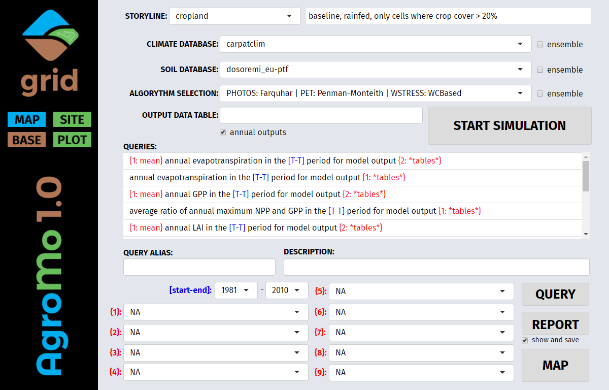
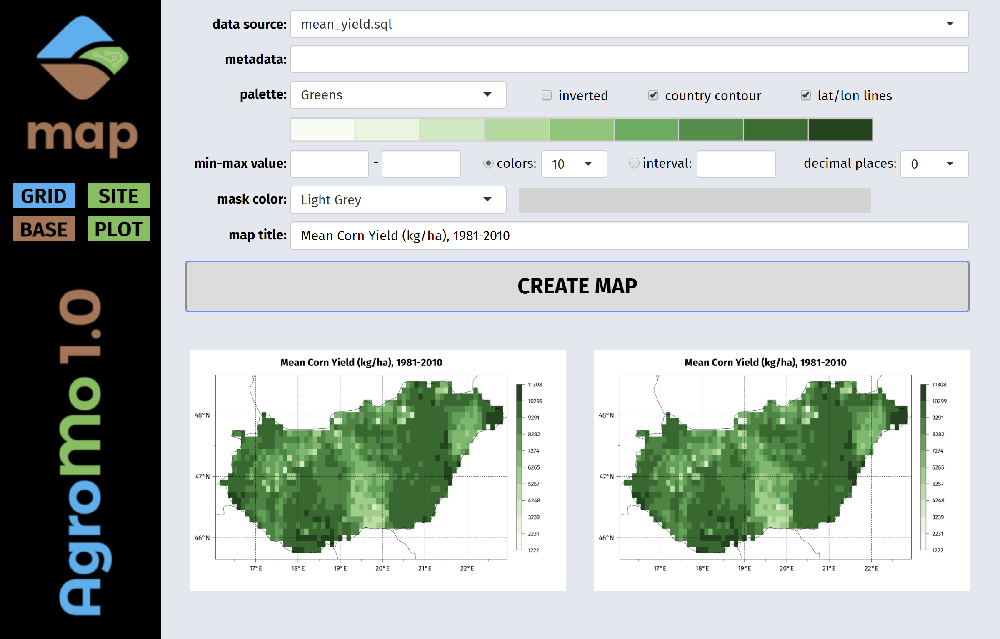

# AgroMo project

## Introduction

AgroMo is an Integrated Assessment and Modelling software that integrates 4M (Fodor et al. 2014) a CERES based crop model, the Biome-BGCMuSo (Hidy et al. 2016) biogeochemical and a simple agro-economical model in order to support decision makers at multiple scales.

## AgroMo User Interface

A graphical user interface (GUI) has been developed for providing easy and user friendly access to the functions of the AgroMo system. When lunching the AgroMo App the user meets the AgroMo Base form first.

### AgroMo Base


- [x] Choose/change the main directory where your data files are located (in the required [subdirectory system](img/AgroMo_File_System.pdf)) by clicking the [MODIFY] button. The default location is the AgroMo\data folder.
- [x] Run the model for a specific site/plot by clicking the [SITE] button.
- [x] Create plots of the simulation results by clicking the [PLOT] button.
- [x] Make gridded model runs by clicking the [GRID] button.
- [x] Present the results of a gridded simulation on a map by clicking the [MAP] button.
- [x] Carry out Sensitivity analysis, Parameter sweep or Parameter calibration by clicking the [PARAMETER ANALYSIS] button. 
- [x] Import weather and soil data from international databases into local input files by clicking the [INPUT IMPORT] button.
- [x] Create storyline and corresponding input files for gridded model runs by clicking the [INPUT CREATOR] button.
- [x] Select GUI language by click one of the flag icons to the right. Hungarian, English and German versions are available at the moment.
- [x] Exit AgroMo by clicking the EXIT icon on the banner to the left.


### AgroMo Site


- [x] The dropdown menus display the files, only with the prescribed extension, of the corresponding directories within the prescribed input folder system:
  - INI files (extension: .ini): .\input\initialization\site\
  - WEATHER files (extension: .wth): .\input\weather\site\
  - SOIL files (extension: .soi): .\input\soil\site\
  - MANAGEMENT files (extension: .mgm): .\input\management\site\
     - planting management option file (extension: .plt): .\input\management\site\planting\
     - harvest management option file (extension: .hrv): .\input\management\site\harvest\
     - fertilization management option file (extension: .frz): .\input\management\site\fertilization\
     - irrigation management option file (extension: .irr): .\input\management\site\irrigation\
     - cultivation management option file (extension: .cul): .\input\management\site\cultivation\
     - grazing management option file (extension: .grz): .\input\management\site\grazing\
     - mowing management option file (extension: .mow): .\input\management\site\mowing\
     - thinning management option file (extension: .thn): .\input\management\site\thinning\
  - PLANT specific input files (extension: .epc; folder: .\input\plant\) are referred to in the planting files
- [x] When selecting an INI file the WEATHER, SOIL and MANAGEMENT files that are referred to in the INI file are automatically selected from the corresponding dropdown menus, but those could be changed freely any time.
- [x] In case new INI, WEATHER, SOIL, MANAGEMENT, etc. files are placed to the corresponding folders of the file system, click the green [REFRESH] button to see the new files in the corresponding dropdown menus.
- [x] When selecting a MANAGEMENT file the management option files that are referred to in the MANAGEMENT file are automatically selected from the corresponding dropdown menus, but those could be changed freely any time.
- [x] The most important parameters of the management options could be changed without accessing the management option file by adjusting the input values using the corresponding textboxes within the 'shift in...' section. Negative values could also be used.
- [x] Give a name to the simulation run in the 'OUTPUT DATA TABLE' textbox. Output data are stored in an SQLite data table using the name defined in the textbox.
- [x] After selecting the desired input files and optionally set up the changes in the 'shift in...' section simulation starts by clicking the [START SIMULATION] button.
- [x] An activity indicator is on while the simulation is running. 
- [x] To see simulation results on graphs click the [PLOT] button.
- [x] Navigate to the [BASE], [GRID] or [MAP] component by clicking the corresponding button on the banner to the left.
- [x] In case at least one GRID run has already been carried out, grid cell specific outputs can be retrieved and plotted by (1) setting the SITE/GRID switch to grid state, (2) selecting the OUTPUT DATABASE table, and the (3) CELL id, (4) setting the name of the OUTPUT DATA TABLE, and finally clicking the [RETRIEVE CELL DATA] button.

### AgroMo Plot


- [x] Select a maximum of 5 simulation results from the left side list by clicking the items. Clicking again deselects the item.
- [x] Select output variable(s) from the right side list for presenting them on the plot(s).
- [x] Enter an alias for the observed data to be presented on the graph.
- [x] Observed data could be added to the plots by selecting the data file from the corrresponding dropdown lists. NOTE, that data in the observed data tables should be structured according to prescribed rules. Observed (experimental) data should be stored in the '.\observation\' folder in a semicolon separated text file with .obs extension. var_id, date and mean (of the observations) values are compulsory for each record, optionally followed by the sd, min and max of the observed values.
- [x] For each selected output variable select:
  - a |time step| for which the daily data are to be aggregated into one single value (e.g. for presenting annual values the 'year' option should be selected).
  - a |function| that defines the aggregation (e.g. for presenting the final yield for each year the 'max' option should be selected)
  - a |plot type| 
- [x] Options in the |time step|, |function| and |plot type| columns can be selected via circular menus operated by clicking/scrolling in the corresponding cells.
- [x] Having all the desired options selected, create plot(s) by clicking the [CREATE PLOT] button.
- [x] Output variables can be filtered accoording to a couple of predefined tags, that may be edited in the centralData.json file.


- [x] Zoom in the graph by selecting an area on the graph while holding down the left mouse button.
- [x] Move the x/y axes by dragging them in the middle (cursor changes) and move the pointer horizontally/vertically.
- [x] Expand/Contract the x/y axes by dragging the end of the axis (cursor changes) and move the pointer horizontally/vertically.
- [x] Hide/Expose a curve on the plot by clicking the corresponding label in the legend.
- [ ] Export plot data into various file formats (e.g. xlsx, csv) by clicking the [EXPORT] button.
- [x] Navigate to the [BASE], [SITE], [GRID] or [MAP] component by clicking the corresponding button on the banner to the left.


### AgroMo Grid



As an INI file controls a site specific simulation a STORY file defines a whole STORYLINE for a gridded simulation. A STORYLINE is set ot INI file sets: comprises a set/series of INI files for every individual cells in the grid. A STORYLINE defines what happens, where and when in the grid inlcuding crop rotation or even land use changes facilitated by INI file changes. In a STORY file all the grid cells are listed and for each cell a series of INI files are listed with an indication of the start and end years when the INI file needs to be activated and deactivated. 

- [x] Coming soon

#### Queries:
- [x] Coming soon

### AgroMo Map



- [x] Coming soon


## Install AgroMo

AgroMo GUI uses the freely available Fira Sans font family. Please, install the font in order to obtain proper outlook. The font is available [here](https://fonts.google.com/specimen/Fira+Sans).

### Using Installer

[Direct link to the Installer](https://owncloud.agrar.mta.hu/owncloud/index.php/s/tN5JaGuLsjBrjzv/download)

- [x] After starting the Installer, choose installation folder by entering a valid folder name with full path or by clicking the Modify icon or leave default unaltered. If the folder does not exist the installer will create it.
- [x] AgroMo can be started from this folder later by launching the AgroMo_Launch.exe application.

### Using pure R

AgroMo can be used from your browser with your current R installation. The package can be installed in the following way:
```{r}
install.packages("remotes") # if you have already installed devtools or remotes, skip this step.
remotes::install_github("hollorol/AgroMo", upgrade = "never") # You can replace remotes with devtools.
```
After the installation process, the application starts with the following command:
```{r}
AgroMo::launchApp()
```
