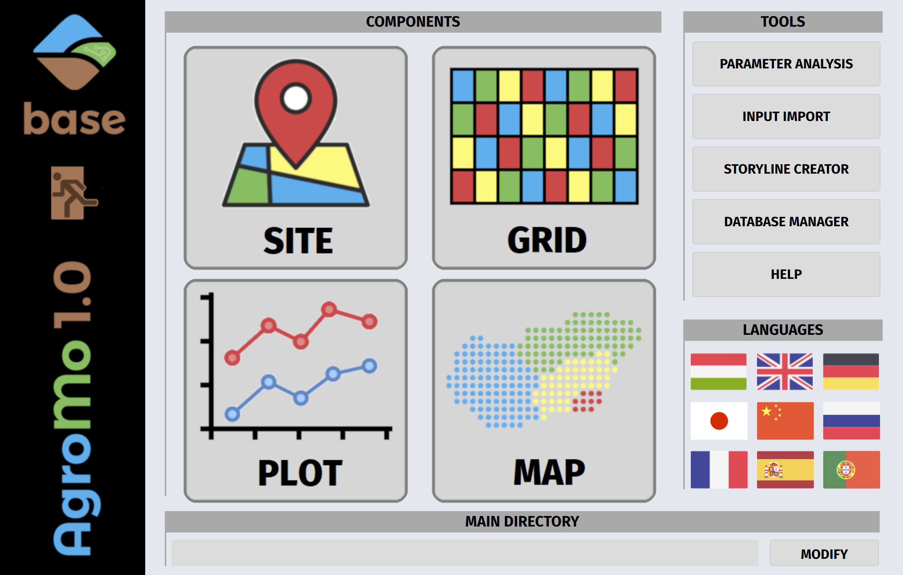
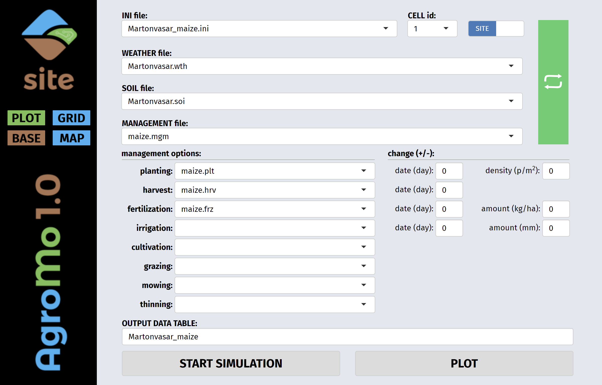
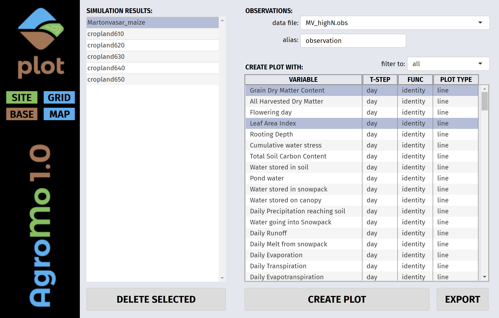
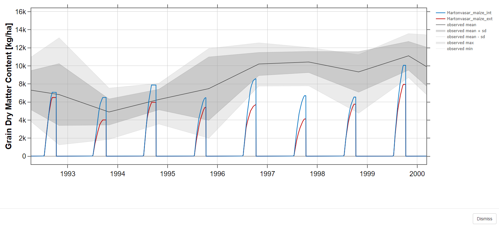

# AgroMo project

## Introduction

AgroMo is an Integrated Assessment and Modelling software that integrates 4M (Fodor et al. 2014) a CERES based crop model, the Biome-BGCMuSo (Hidy et al. 2016) biogeochemical and a simple agro-economical model in order to support decision makers at multiple scales.

## Install AgroMo

### Using Installer

[Direct link to the Installer](https://owncloud.agrar.mta.hu/owncloud/index.php/s/tN5JaGuLsjBrjzv/download)

- [x] After starting the Installer, choose installation folder by entering a valid folder name with full path or by clicking the Modify icon or leave default unaltered. If the folder does not exist the installer will create it.
- [x] AgroMo can be started from this folder later by launching the AgroMo_Launch.exe application.

### Using pure R

AgroMo can be used from your browser with your current R installation. The package can be installed in the following way:
```{r}
install.packages("remotes") # if you have already installed devtools or remotes, skip this step.
remotes::install_github("hollorol/AgroMo", upgrade = "never") # You can replace remotes with devtools.
```
After the installation process, the application starts with the following command:
```{r}
AgroMo::launchApp()
```

## AgroMo User Interface

A graphical user interface (GUI) has been developed for providing easy and user friendly access to the functions of the AgroMo system. When lunching the AgroMo App the user meets the AgroMo Base form first.

### AgroMo Base



- [x] Choose/change the main directory where your data files are located (in a fixed subdirectory system) by clicking the [CHOOSE] button.
- [x] Run the model for a specific site/plot by clicking the [SITE] button.
- [x] Create plots of the simulation results by clicking the [PLOT] button.
- [ ] Make gridded model runds by clicking the [GRID] button.
- [ ] Present the results of a gridded simulation on a map by clicking the [MAP] button.
- [ ] Create, open, edit and save your input files by clicking the [INPUT FILE MANAGER] button.
- [x] Exit AgroMo by clicking the EXIT icon on the banner to the left.


### AgroMo Site


- [x] The dropdown menus display the content, files only with the prescribed extension, of the corresponding directories within the input folder:
  - INI file (extension: .ini): .\input\initialization\
  - WEATHER file (extension: .wth): .\input\weather\site\
  - SOIL file (extension: .soi): .\input\soil\site\
  - MANAGEMENT file (extension: .mgm): .\input\management\
     - planting management option file (extension: .plt): .\input\management\planting\
     - harvest management option file (extension: .hrv): .\input\management\harvest\
     - fertilization management option file (extension: .frz): .\input\management\fertilization\
     - irrigation management option file (extension: .irr): .\input\management\irrigation\
     - cultivation management option file (extension: .cul): .\input\management\cultivation\
     - grazing management option file (extension: .grz): .\input\management\grazing\
     - mowing management option file (extension: .mow): .\input\management\mowing\
     - thinning management option file (extension: .thn): .\input\management\thinning\
  - PLANT specific input files (extension: .epc; folder: .\input\plant\) are referred to in the planting files
- [x] When selecting an INI file the WEATHER, SOIL and MANAGEMENT files that are referred to in the INI file are automatically selected from the corresponding dropdown menus, but those could be changed freely.
- [x] In case new INI, WEATHER, SOIL, MANAGEMENT or management option files are placed to the corresponding folders of the file system, click the green [REFRESH] button to see the new files in the corresponding dropdown menus.
- [x] When selecting a MANAGEMENT file the management option files that are referred to in the MANAGEMENT file are automatically selected from the corresponding dropdown menus, but those could be changed freely.
- [x] The most important parameters of the management options could be changed without accessing the management option file by adjusting the parameter values using the corresponding textboxes within the 'shift in...' section. Pay attention to add sign (+/-) to the values.
- [x] Give a name to the simulation run in the 'OUTPUT id' textbox. Output data are stored in a SQLite datatable named after the 'OUTPUT id's.
- [x] After selecting the desired input files and optionally set up the changes in the 'shift in...' simulation starts by clicking the [RUN] button.
- [x] An activity indicator is on while the simulation is running. 
- [x] To see simulation results on graphs click the [PLOT] button.
- [x] Navigate to the [BASE] or [GRID] component by clicking the corresponding button on the banner to the left.

### AgroMo Plot


- [x] Select a maximum of 5 simulation results from the left side list by clicking the items. Clicking again deselects the item.
- [x] Select variable(s) from the right side list for presenting them on the plot(s).
- [ ] Observed data could be added to the plots by selecting the EXPERIMENT and TREATMENT ids from the corrresponding dropdown lists. NOTE, that data in the observed data tables should be structured according to the prescribed rules. Observed (experimental) data should be stored in the '.\observation\' folder in a SQLite database: one table for one experiment. Observed data available in multiple repetitions could be presented on the plot in two ways: 1) each repetition as separate data point, or 2) one single data point representing the mean of the repetitions. Leaving the EXPERIMENT ID dropdown list empty results in presenting simulation results only on the plot(s).
- [x] For each selected variable select:
  - a |time step| for which the daily data are to be aggregated into one single value (e.g. for presenting annual values the 'year' option should be selected).
  - a |function| that defines the aggregation (e.g. for presenting the final yield for each year the 'max' option should be selected)
  - a |plot type| 
- [x] Options in the |time step|, |function| and |plot type| columns can be selected via circular menus operated by clicking/scrolling in the corresponding cells.
- [x] Having all the desired options selected create plot(s) by clicking the [PLOT] button.



- [x] Zoom in the graph by selecting an area on the graph while holding down the left mouse button.
- [ ] Export plot data into various file formats (e.g. xlsx, csv) by clicking the [EXPORT] button.
- [x] Navigate to the [BASE] or [SITE] component by clicking the corresponding button on the banner to the left.


### AgroMo Grid

#### Queries:
NOTES: 1) in case no depth info is provided in a soil related query, by default it referes to the top soil (0-30 cm depth); 2) time slice dependent queries with no indication of the time period, by default refere to the baseline period (1981-2010); 
- sandy soils | homok talajok
- soils with SOM greater than 2% | >2% szervesanyag-tartalmű talajok
- places 200+ m above sea level | a tengerszint felett 200 m-nél magasabban fekvő területek
- arable lands | szántó területek
- places with average temperature greater then 10 °C | 10 °C-nél magasabb átlaghőmérsékletű területek
- average/minimum/maximum/10th/90th percentile yield | a termés átlaga/minimuma/maximuma/10-ik/90-ik percentilise
- 0-3 cm soil layer mean temperature in May in the 2071-2100 period | 0-3 cm talajréteg májusi átlaghőmérséklete a 2071-2100 időszakban


  
